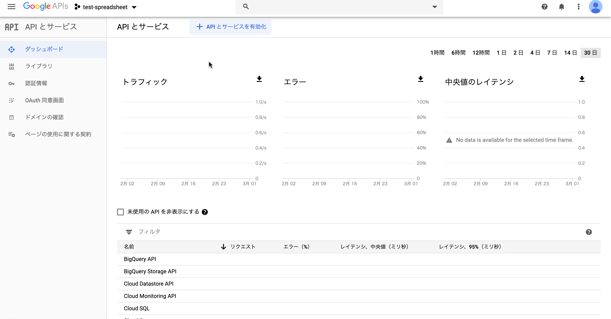
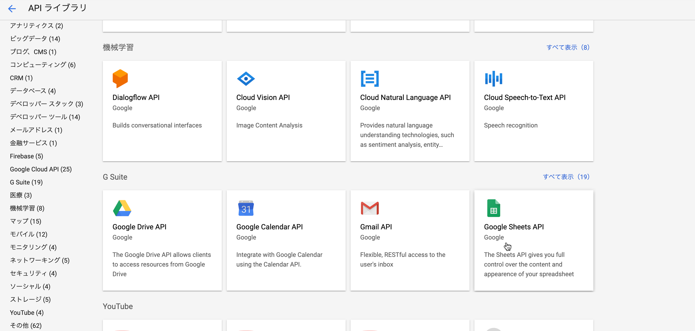
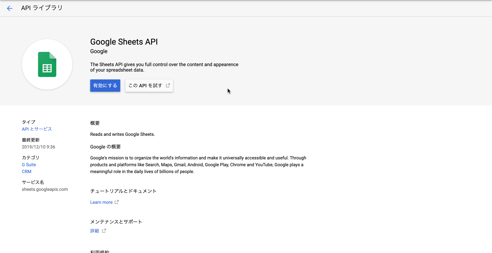
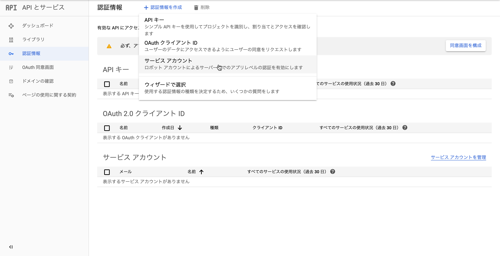
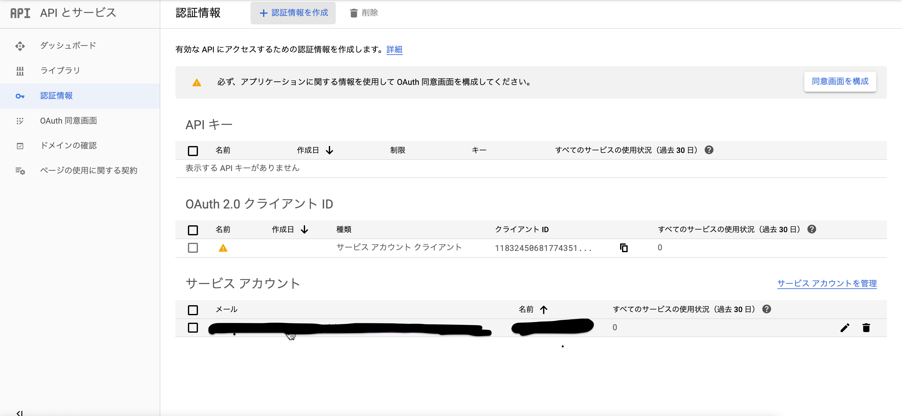

# 【Node.js】 Googleスプレッドシートを簡易データベースとして使う

## 目標

Googleスプレッドシートをデータベースと見立て操作を行うプログラムを作成する.

## Google Sheets APIクライアントアカウントを作成する.

1. [Google開発者向けサービス](https://console.developers.google.com/apis/dashboard) 
の上部タブより[プロジェクトの選択] > [新しいプロジェクト]へ進みプロジェクトを作成する.

2. 1で作成したプロジェクト [ダッシュボード]上で[APIとサービスを有効化]をクリックし、
    [Google Sheets API]を選択し, これを有効化.







3. 1で作成したプロジェクトの[認証情報]上で[認証情報を作成]>[サービス アカウントの作成]へ進み, 
    サービスアカウントを作成



4. プロジェクトの[認証情報]画面上で, 3で作成したアカウントの詳細に進み, [キーを作成]ボタンをクリック. 
    認証キーが作成されるのでjson形式で保存する.



---

## set up

npmでjsプロジェクを作成しましょう.

またスプレッドシート操作のため、Google Sheets API v4のjs wrapper[google-spreadsheet](https://www.npmjs.com/package/google-spreadsheet)を同時にinstallします.

```Terminal
npm init -y
npm i google-spreadsheet
```

---

## スプレッドシートの情報にアクセスする

サービスアカウントにスプレッドシートの閲覧権限を与えておくことにより, 
サービスアカウントによる認証ののち、スプレッドシートの情報にアクセスすることができます. 
(一般ユーザーに公開されているスプレッドシートへのアクセスにはAPIキー認証で十分.)

以下は, スプレッドシートのキーからタイトルを取得するプログラムになります.

- getSpreadsheetTitle.js

```js
const { GoogleSpreadsheet } = require('google-spreadsheet');
// 認証情報jsonファイルを読み込む
const CREDIT = require('<認証情報jsonファイルへのパス>')
// スプレッドシートキー
const SPREADSHEET_KEY = '<spreadsheetのキー>'

const getSpreadsheetTitleByKey = async (spreasheetKey) => {
    // 一般ユーザーに公開していないスプレッドシートへアクセスしたい場合, 作成したサービスアカウントに対し
    // 閲覧権限を与えておく.
    const doc = new GoogleSpreadsheet(spreasheetKey);
    
    // サービスアカウントによる認証
    await doc.useServiceAccountAuth({
        client_email: CREDIT.client_email,
        private_key: CREDIT.private_key,
    });

    // スプレッドシートの情報を読み込みを行い, タイトルを取得
    await doc.loadInfo(); 
    console.log(doc.title);
}

getSpreadsheetTitleByKey(SPREADSHEET_KEY)
// <スプレッドシートのタイトル>
```

---

## Googleスプレッドシートをデータベースとして使う

Googleスプレッドシートをデータベースとして使う

1. 空白のスプレッドシートに列名を設定する

`setHeaderRow`メソッドで空白のスプレッドシートに1行目に列名をセットする.

```js
const { GoogleSpreadsheet } = require('google-spreadsheet');
// 認証情報jsonファイルを読み込む
const CREDIT = require('<認証情報jsonファイルへのパス>')
// スプレッドシートキー
const SPREADSHEET_KEY = '<spreadsheetのキー>'

const setHeaderToSpreadsheet = async (spreasheetKey, sheetIndex, headerValues) => {
    
    const doc = new GoogleSpreadsheet(spreasheetKey);
    
    await doc.useServiceAccountAuth({
        client_email: CREDIT.client_email,
        private_key: CREDIT.private_key,
    });

    // スプレッドシートの情報を読み込みを行い, タイトルを取得
    await doc.loadInfo(); 
    const sheet = doc.sheetsByIndex[sheetIndex]

    // ヘッダー行を作成する
    await sheet.setHeaderRow(headerValues)
}

setHeaderToSpreadsheet(SPREADSHEET_KEY, 0, ['id', 'name', 'age'])
```

2. 更新・読み取り・更新・削除処理の実装

Googleスプレッドシートをデータベースとして利用するため、リソースに対する更新・読み取り・更新・削除(**CRUD処理**)を実装した.

- spreadSheetService.js 

```js
class SpreadSheetService {
    /**
     * コンストラクター
     * @param {*} spreadsheetKey スプレッドシートキー
     */
    constructor(spreadsheetKey) {
        this.doc = new GoogleSpreadsheet(spreadsheetKey);
    }
    /**
     * サービスアカウントを用いて認証を行う
     * @param {*} credit 
     */
    async authorize(credit) {
        await this.doc.useServiceAccountAuth({
            client_email: credit.client_email,
            private_key: credit.private_key,
        });
    }
    /**
     * 行データを返す
     * @param {*} index 
     */
    async getRows(index) {
        await this.doc.loadInfo(); 
        const sheet = this.doc.sheetsByIndex[index]
        return sheet.getRows();
    }
    /**
     * 行を追加する
     * @param {*} value 
     */
    async insert(value) {
        await this.doc.loadInfo(); 
        const sheet = this.doc.sheetsByIndex[0]
        return await sheet.addRow(value);
    }
    /**
     * データを取得する
     * @param {*} callBack 
     */
    async select(callBack) {
        const rows = await this.getRows(0)
        const data = []
        for (const row of rows) {
            if (callBack(row)) {
                data.push({id: row.id, name: row.name, age:row.age})
            }
        }
        return data
    }
    /** 
     * idに紐づくユーザーの情報を更新する
    */
    async updateById(id, value) {
        const rows = await this.getRows(0);
        for (const row of rows) {
            if (row.id == id) {
                for (const attr in value) {
                    row[attr] = value[attr]
                    await row.save()
                }
            }
        }
    }
    /**
     * idに紐づくユーザーを削除する
     * @param {*} id 
     */
    async deleteById(id) {
        const rows = await this.getRows(0);
        for (const row of rows) {
            if (row.id == id) {
                await row.delete()
            }
        }
    }
}

module.exports = SpreadSheetService
```

では実際にスプレッドシートの操作を行ってみる.

### リソースの追加

- demo.js

```js 
const SpreadSheetService = require('./spreadSheetService')
// 認証情報jsonファイルを読み込む
const CREDIT = require('<認証情報jsonファイルへのパス>')
// スプレッドシートキー
const SPREADSHEET_KEY = '<spreadsheetのキー>'

// データを4件追加
// データを追加
const insertMany = async () => {
    await spreadSheetService.insert({id:1, name:'John Doe', age:40})
    await spreadSheetService.insert({id:2, name:'Jane Doe', age:30})
    await spreadSheetService.insert({id:3, name:'山田太郎', age:20})
    await spreadSheetService.insert({id:4, name:'山田花子', age:30})
}

insertMany()
```

スプレッドシートの内容が更新される. 

| id |	name |	age|
|:---:|:---:|:---:|
| 1	|John Doe |	40 |
| 2	|Jane Doe| 30|
| 3 |	山田太郎| 20 |
| 4	| 山田花子	| 30|

### リソースの読み取り

- demo.js

```js 
// ageが30であるユーザーの情報を取得
spreadSheetService.select(row => row.age == 30)
.then(data => console.log(data))
```

出力結果

```js
[{ id: '2', name: 'Jane Doe', age: '30' },
{ id: '4', name: '山田花子', age: '30' }]
```

### リソースの更新

- demo.js

```js
// id=1のユーザーのnameを「Tom Doe」に更新
spreadSheetService.updateById(1, {name: 'Tom Doe'})
```

スプレッドシートのidが1のユーザーのnameが「Tom Doe」に更新される. 

| id |	name |	age|
|:---:|:---:|:---:|
| 1	|Tom Doe |	40 |
| 2	|Jane Doe| 30|
| 3 |	山田太郎| 20 |
| 4	| 山田花子	| 30|

### リソースの削除

- demo.js

```js
// id=4のユーザーを削除
spreadSheetService.deleteById(4)
```

結果をスプレッドシートで確認すると, 

| id |	name |	age|
|:---:|:---:|:---:|
| 1	|Tom Doe |	40 |
| 2	|Jane Doe| 30|
| 3 |	山田太郎| 20 |

## さいごに

今回はGoogleスプレッドシートを簡易データベースと見立ててスプレッドシート操作を行うプログラムを作成しました. 
Googleスプレッドシートをデータベースとして用いてアプリを作成することにより、
SQLなどの知識がないユーザーでも簡単にデータの取得・レポートかができるというメリットがあります. 
そのため社内データの蓄積用のアプリケーション開発に用途があるのではと考えています.
